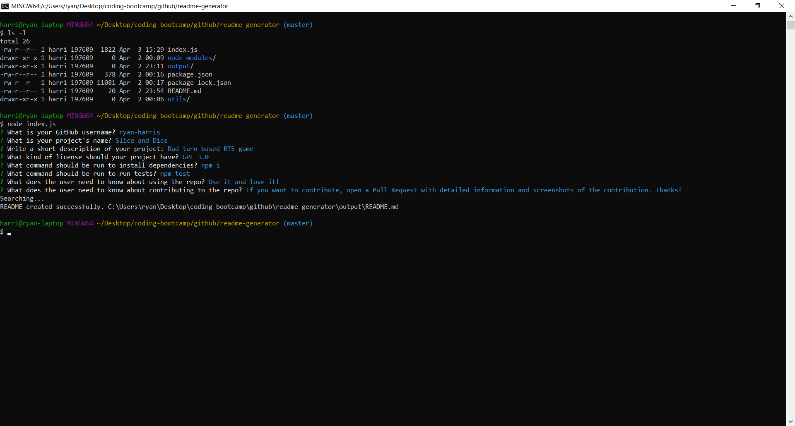

# Readme Generator

## Description

Readme Generator is a command-line application that dynamically generates a README.md from a user's input. The user will be prompted for their GitHub username, which will be used to retrieve their email and profile image from the GitHub API. They will also be asked a series of questions about their project. See the [Example](#example) below.

## Table of Contents

- [Installation](#installation)
- [Usage](#usage)
- [Contributing](#contributing)
- [Questions](#questions)

## Installation

To install the required dependencies, run the command:

```
npm install
```

In order to retrieve emails from the GitHub API, please create a `.env` file in the same folder as index.js and include `TOKEN=personal_access_token` inside the file.

To obtain a personal access token from GitHub, follow the instructions at the link below (make sure to check the option `user:email`): https://help.github.com/en/github/authenticating-to-github/creating-a-personal-access-token-for-the-command-line

If the .env file and TOKEN aren't present, the app will simply ask the user for their email.

## Usage

To run the program, run the following command:

```
node index.js
```

## Example

- Video example: https://www.youtube.com/watch?v=ZpKANxwCkgM
- Screenshot of Program

  

## Contributing

If you want to contribute, feel free! Open a Pull Request and include a detailed description and screenshots of the changes.

## Questions

If you have any questions about the repo, open an issue or contact [ryan-harris](https://github.com/ryan-harris) directly at harris.ucla@gmail.com
